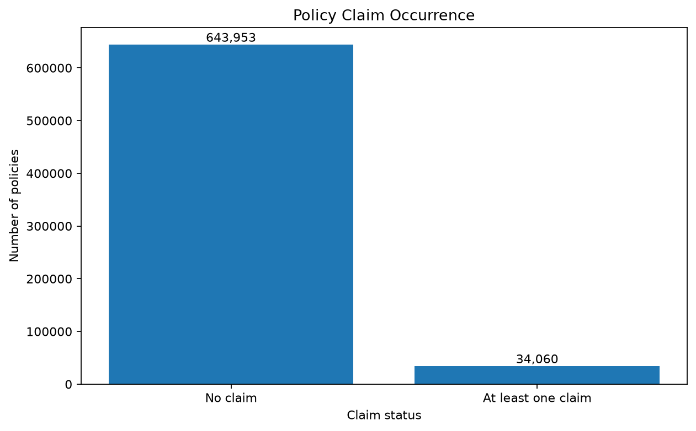
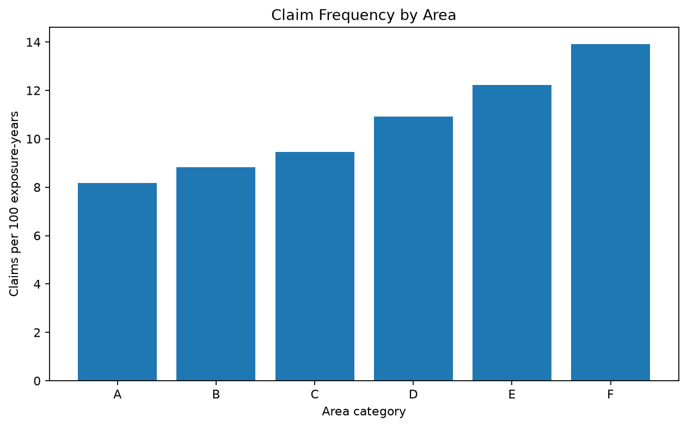
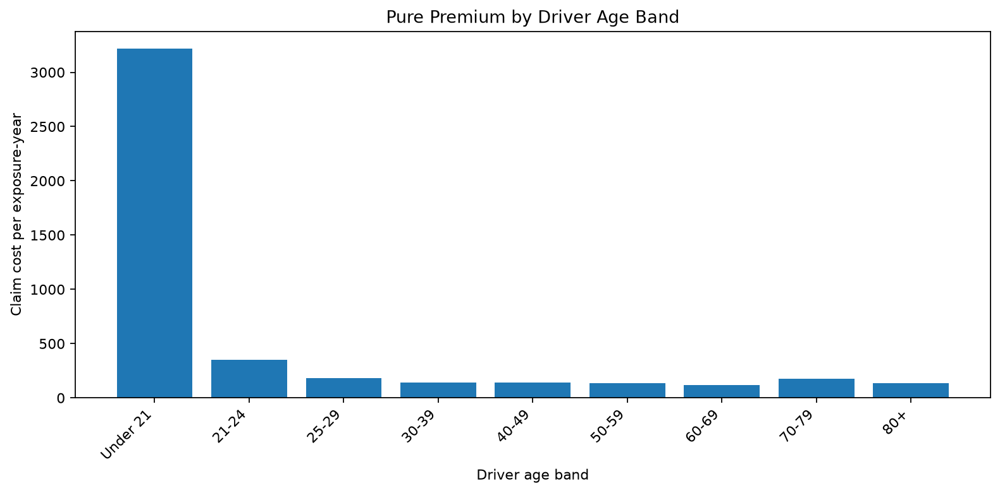

# Insurance Claims Risk Intelligence

## Project Overview

This project develops an end-to-end insurance claims analytics system
for a fictional Canadian automobile insurance company called Prairie
Shield Insurance.

The project will combine Python, SQL, statistical modelling, machine
learning, financial analysis, forecasting, and Power BI to support
insurance claims and risk-management decisions.

## Business Problem

Prairie Shield Insurance needs a data-driven system for:

- monitoring claims performance;
- identifying high-risk claims and policies;
- predicting claim costs;
- measuring financial and operational KPIs;
- forecasting future monthly claim costs;
- communicating findings through interactive dashboards.

The predictive models will be used as decision-support tools. They will
not automatically approve or reject insurance claims.

## Project Objectives

The main objectives are to:

1. Build a reproducible data-cleaning pipeline.
2. Store and analyze insurance data using SQL.
3. Conduct exploratory and financial analysis.
4. Predict insurance claim severity.
5. Classify claims according to risk.
6. Forecast monthly claim costs.
7. Explain the factors influencing model predictions.
8. Build an interactive Power BI dashboard.
9. Produce a non-technical executive summary.

## Planned Technology Stack

- Python
- Pandas
- NumPy
- Matplotlib
- scikit-learn
- statsmodels
- SQL
- Power BI
- DAX
- Power Query
- Microsoft Excel
- Git and GitHub

## Exploratory Analysis

The exploratory analysis examines claim occurrence, claim frequency,
claim severity, pure premium, and differences across policy segments.

### Claim Occurrence



### Claim Frequency by Area



### Pure Premium by Driver Age Band



The charts show unadjusted historical relationships. They should not be
interpreted as causal effects.

## Completed

- Selected the freMTPL2 motor-insurance dataset.
- Created a reproducible OpenML download script.
- Documented the dataset variables and limitations.
- Defined the policy-level modelling targets.
- Completed the initial data-quality inspection.
- Examined data types, missing values, duplicates, and numerical ranges.
- Validated policy identifiers and categorical values.
- Compared policy claim counts with claim-level severity records.
- Generated a reproducible data-quality summary.
- Standardized the policy and claim datasets.
- Created structural validity flags.
- Aggregated individual claim amounts to the policy level.
- Classified cross-table claim-count inconsistencies.
- Created model-specific eligibility indicators.
- Built the first policy-level analytical dataset.
- Completed exploratory analysis of the insurance portfolio.
- Calculated portfolio-level claim frequency, severity, and pure premium.
- Compared claim outcomes across driver, vehicle, and geographic groups.
- Examined the highly skewed claim-amount distribution.
- Created reusable summary tables and GitHub-ready figures.

## Upcoming

- Build the relational SQLite database.
- Write reusable SQL queries for insurance KPIs.
- Validate SQL results against the Python analysis.
- Prepare baseline claim-occurrence and frequency models.

## Repository Structure

```text
insurance-risk-intelligence/
├── data/
│   ├── raw/
│   ├── interim/
│   └── processed/
├── database/
├── docs/
├── notebooks/
├── powerbi/
├── reports/
├── src/
└── tests/

