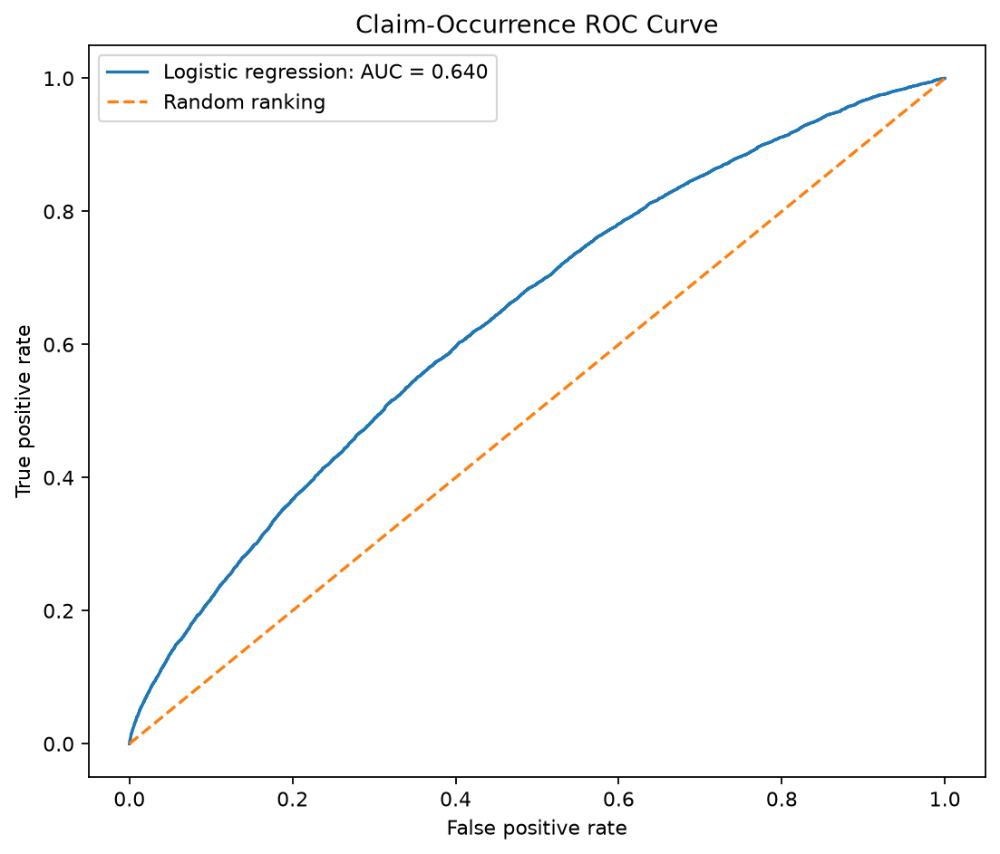
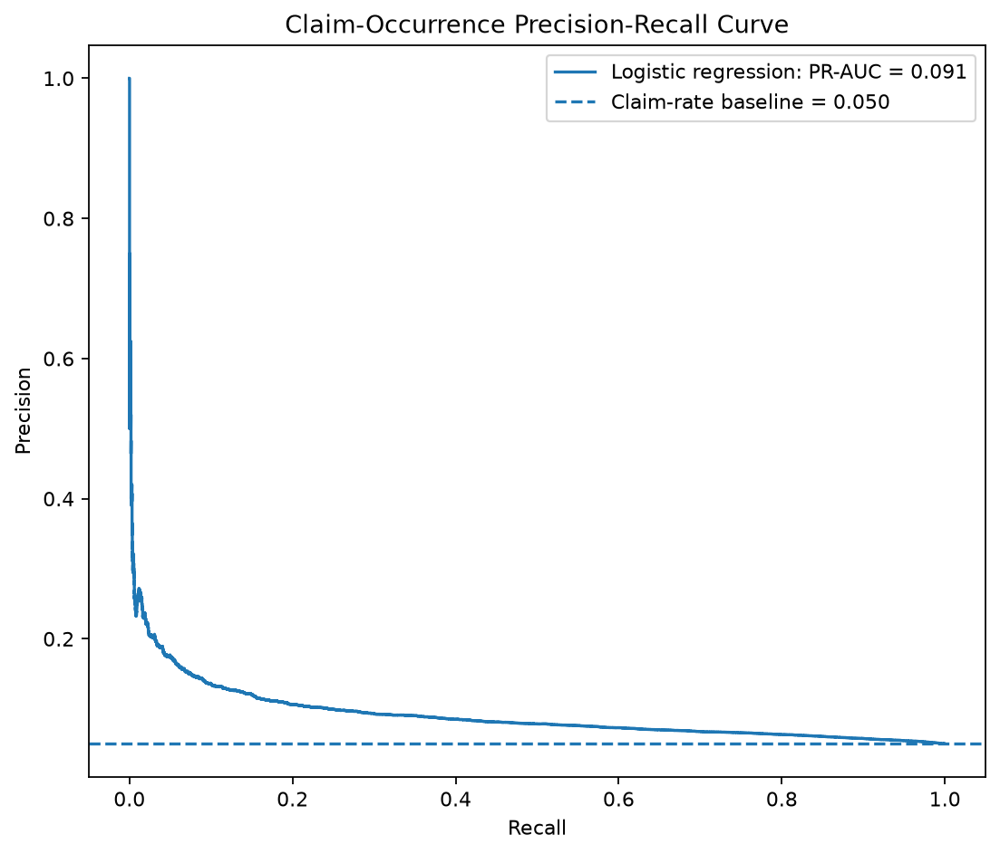
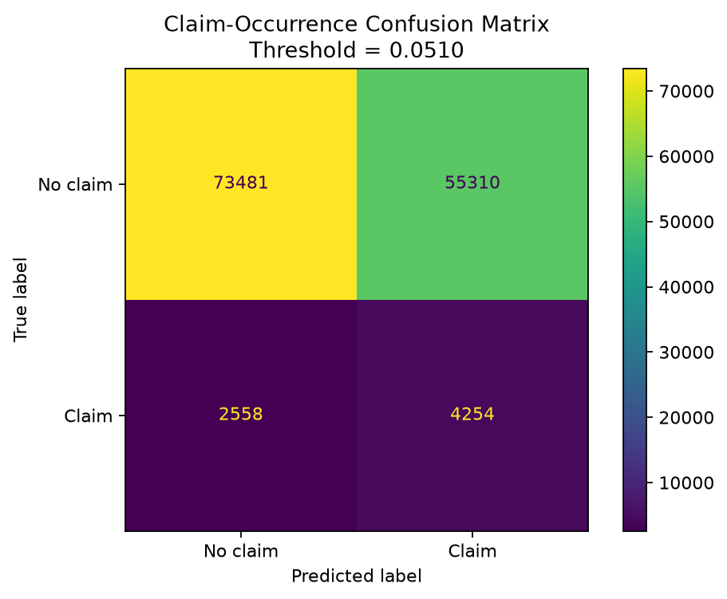
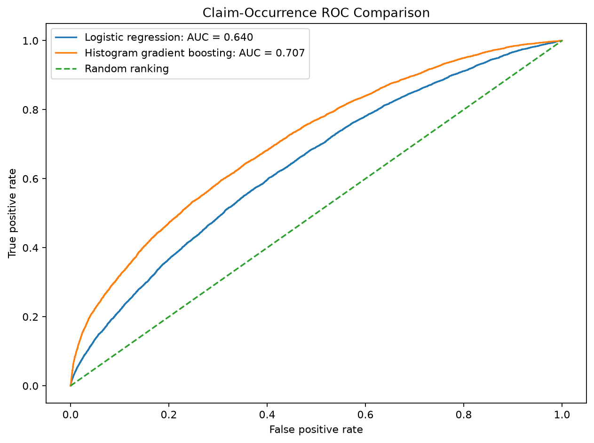
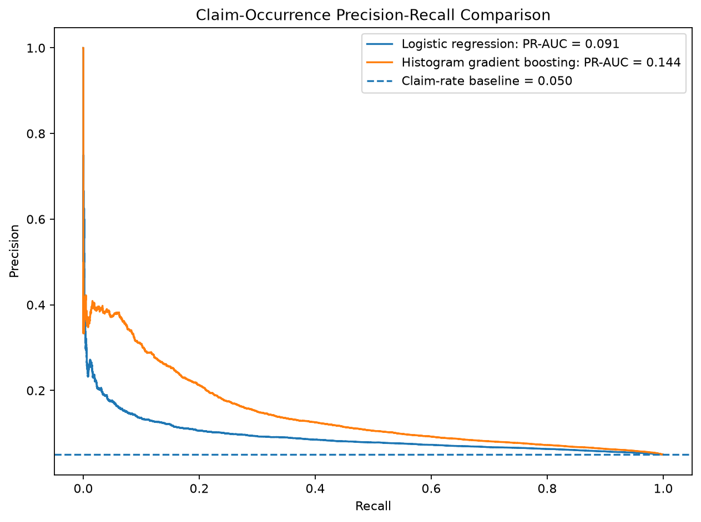
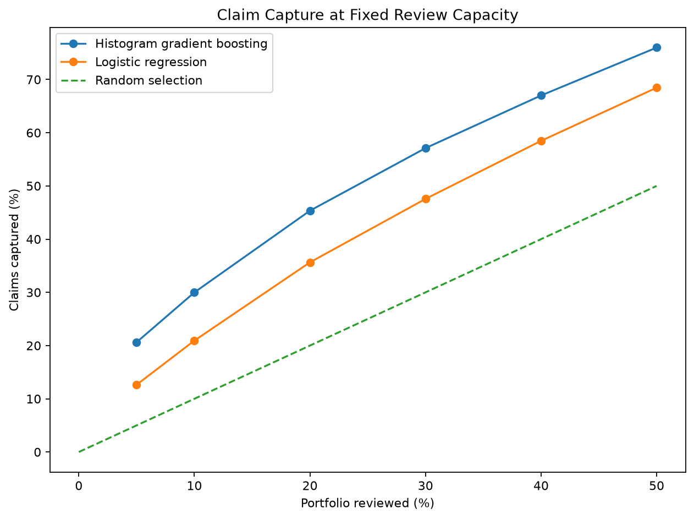
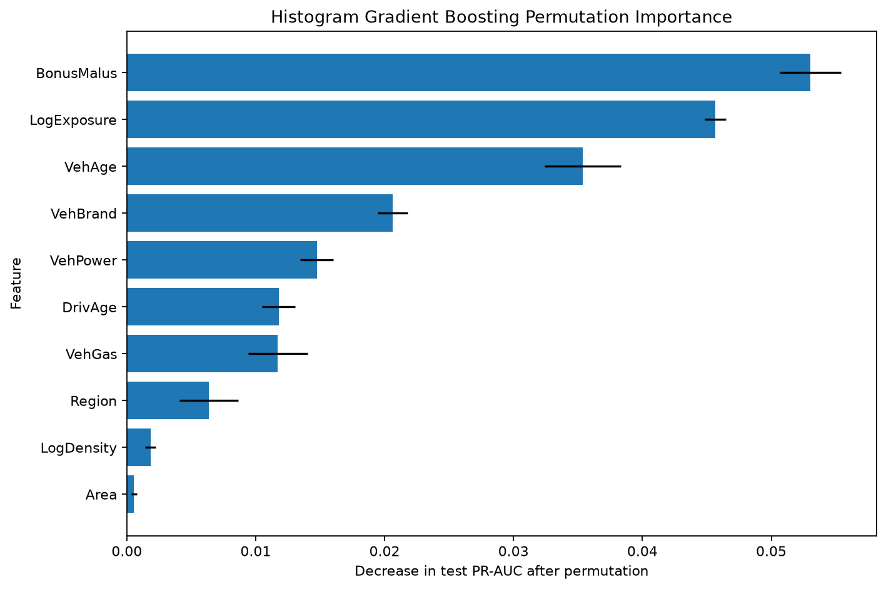

# Insurance Claims Risk Intelligence

## Project Overview

This project develops an end-to-end insurance claims analytics system
for a fictional Canadian automobile insurance company called Prairie
Shield Insurance.

The project will combine Python, SQL, statistical modelling, machine
learning, financial analysis, forecasting, and Power BI to support
insurance claims and risk-management decisions.

## Business Problem

Prairie Shield Insurance needs a data-driven system for:

- monitoring claims performance;
- identifying high-risk claims and policies;
- predicting claim costs;
- measuring financial and operational KPIs;
- forecasting future monthly claim costs;
- communicating findings through interactive dashboards.

The predictive models will be used as decision-support tools. They will
not automatically approve or reject insurance claims.

## Project Objectives

The main objectives are to:

1. Build a reproducible data-cleaning pipeline.
2. Store and analyze insurance data using SQL.
3. Conduct exploratory and financial analysis.
4. Predict insurance claim severity.
5. Classify claims according to risk.
6. Forecast monthly claim costs.
7. Explain the factors influencing model predictions.
8. Build an interactive Power BI dashboard.
9. Produce a non-technical executive summary.

## Planned Technology Stack

- Python
- Pandas
- NumPy
- Matplotlib
- scikit-learn
- statsmodels
- SQL
- Power BI
- DAX
- Power Query
- Microsoft Excel
- Git and GitHub

## Exploratory Analysis

The exploratory analysis examines claim occurrence, claim frequency,
claim severity, pure premium, and differences across policy segments.

### Claim Occurrence


### Claim Frequency by Area


### Pure Premium by Driver Age Band


The charts show unadjusted historical relationships. They should not be
interpreted as causal effects.

## Claim-Occurrence Model

A logistic-regression model estimates whether a policy will report at
least one claim during its observed exposure period.

The model uses driver, vehicle, geographic, and exposure
characteristics. Claim and severity outcomes are excluded from the
predictors to prevent data leakage.

### ROC Curve



### Precision-Recall Curve



### Confusion Matrix



The classification threshold was selected using the validation sample
and an F2 objective that gives greater importance to identifying claim
policies.

## Claim-Occurrence Model Comparison

The baseline logistic-regression model was compared with histogram
gradient boosting using identical training, validation, and test
samples.

The preferred model was selected using validation PR-AUC. Each model's
classification threshold was selected using validation F2-score.

### ROC Comparison



### Precision-Recall Comparison



### Review-Capacity Analysis



### Permutation Feature Importance



The capacity analysis measures how many claim policies are captured
when only a fixed percentage of the highest-scored portfolio can be
reviewed.

## Completed

- Selected the freMTPL2 motor-insurance dataset.
- Created a reproducible OpenML download script.
- Documented the dataset variables and limitations.
- Defined the policy-level modelling targets.
- Completed the initial data-quality inspection.
- Examined data types, missing values, duplicates, and numerical ranges.
- Validated policy identifiers and categorical values.
- Compared policy claim counts with claim-level severity records.
- Generated a reproducible data-quality summary.
- Standardized the policy and claim datasets.
- Created structural validity flags.
- Aggregated individual claim amounts to the policy level.
- Classified cross-table claim-count inconsistencies.
- Created model-specific eligibility indicators.
- Built the first policy-level analytical dataset.
- Completed exploratory analysis of the insurance portfolio.
- Calculated portfolio-level claim frequency, severity, and pure premium.
- Compared claim outcomes across driver, vehicle, and geographic groups.
- Examined the highly skewed claim-amount distribution.
- Created reusable summary tables and GitHub-ready figures.
- Built a relational SQLite insurance database.
- Connected policy records to valid claim records.
- Preserved unmatched claims in a separate audit table.
- Created SQL views for portfolio KPIs and segment analysis.
- Validated SQL results against the Python calculations.
- Exported reusable SQL reports for future Power BI development.
- Created stratified training, validation, and test samples.
- Built a leakage-safe modelling pipeline.
- Established a no-claim baseline.
- Trained the first claim-occurrence logistic-regression model.
- Selected a classification threshold using validation F2-score.
- Evaluated discrimination, classification, and calibration.
- Documented the strongest model coefficients and limitations.
- Compared logistic regression with histogram gradient boosting.
- Selected the preferred model using validation PR-AUC.
- Compared classification results using validation-selected thresholds.
- Evaluated claim capture at fixed review-capacity levels.
- Calculated test-sample permutation feature importance.
- Audited model performance by area, fuel type, and driver-age band.

## Upcoming

- Build an exposure-adjusted Poisson claim-frequency model.
- Compare observed and predicted claim frequencies.
- Evaluate frequency-model deviance and calibration.
- Build a claim-severity model using complete positive claims.
- Combine frequency and severity predictions into expected loss cost.

## Repository Structure

```text
insurance-risk-intelligence/
├── data/
│   ├── raw/
│   ├── interim/
│   └── processed/
├── database/
├── docs/
├── notebooks/
├── powerbi/
├── reports/
├── src/
└── tests/

